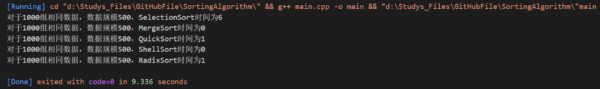
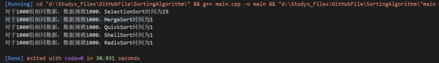
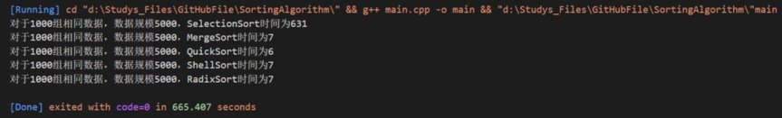
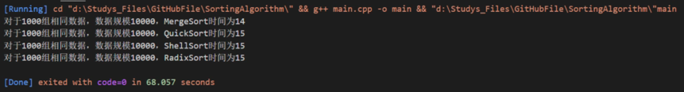
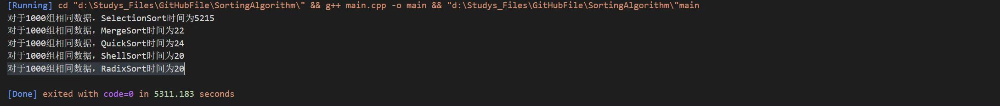

# 北航程序设计与算法课程大作业——大数排序算法
 这是由葛宇飞、王永鑫、张亚奇完成的北京航空航天大学周号益老师所教课程《程序设计与算法》布置的大作业——大数排序算法。
 该作业要求基于C或C++语言，实现[选择、归并、快速、希尔、基数]五种排序算法，对数值范围在[-10^100-10^100]的数组进行排序，并对所有算法进行分析在不同规模的输入下单机性能的变化情况。

# 算法简介

## 使用方法
* 所有排序算法的实现都在sort.h头文件中，每种排序算法输入均为vector<T>& arr；
* 在test.h中实现了随机数据的生成，以及对每种排序算法正确性验证和时间性能的分析；
* 在main.cpp文件中直接调用相应的TestSort即可自动完成统一随机数的生成，然后对每种算法进行正确性验证，最后统一对比每种算法的时间开销。

## 公共方法 

### 数值类型转换函数——string Digitalize(string& a)
此方法主要是获取随机生成的string类型数据的数值化表示    
``` c++
string Digitalize(string& a){
    int i = 0;
    int size = a.size();
    while(i<size && (a[i]<'0'||a[i]>'9')){
        ++i;
    }
    auto result = string(a,i);
    if(!result.size()){
        cout << "invalid input data" << endl;
        exit(0);
    }
    return result;
}
```
### 比较函数——bool cmp<string>(string& a,string& b)
此方法用于比较两个带符号的数之间的大小。  
根据输入数据的符号进行判断大小，如果异号则可直接返回结果，否则去掉符号位后逐位进行比较。  
如果a > b则返回false，否则返回true。
``` c++
template<>
bool cmp<string>(string& a,string& b){
    if(!a.size()||!b.size()){
        cout << "invalid input data" << endl;
        exit(0);
    }
    bool signA = a[0]!='-';
    bool signB = b[0]!='-';
    if(!signA&&signB){
        // a<0,b>0 -> a<b
        return false;
    }else if(signA&&!signB){
        // a>0,b<0 -> a>b
        return true;
    }
    // a,b are same sign
    string digitA = Digitalize(a);
    string digitB = Digitalize(b);
    int endA = digitA.size()-1;
    int endB = digitB.size()-1;
    bool isGreater = false;
    bool isEqual = false;
    // same length
    if(endA==endB){
        for(int i=0;i<=endA;++i){
            if(digitA[i]!=digitB[i]){
                isGreater = digitA[i]>digitB[i];
                break;
            }
            if(i==endA&&digitA[i]==digitB[i]){
                isEqual = true;
            }
        }
    }
    if(signA){
        return endA>endB||isGreater;
    }else{
        return endA<endB||!isGreater&&!isEqual;
    }
}
```
### 打印调试函数——void Print(vector<T>& arr,int size)
此方法主要用于调试程序时逐位打印输出数据使用
``` c++
template<typename T>
void Print(vector<T>& arr,int size){
    for(int i=0;i<size-1;++i){
        cout << arr[i] << ",";
    }
    cout << arr[size-1] << endl;
}
```

## 测试验证方法
### 随机数据生成函数——vector<string> RandomStringArray()
此方法主要用于测试阶段随机数据的生成。  
数据范围为10^30 ，string类型带有正负号
``` c++
template<>
vector<string> RandomArray<string>(){
    srand(time(NULL));
    int size = rand()%50000+1;
    vector<string> arr(size,"");
    for(int i=0;i<size;++i){
        bool sign = rand()%2;
        arr[i] = (sign ? "+" : "-" ) + to_string(rand()%5000);
        for ( int j = 0; j < 5; j++){
            arr[i] += to_string(rand()%5000);
        }
    }
    return arr;
}
```
### 检查数据相等函数——bool Check(vector<T>& arr1,vector<T>& arr2)
此方法主要用于检查两个数是否相等。  
如果两数长度不等则直接返回false，否则按位对比是否相等。
``` c++
template<typename T>
bool Check(vector<T>& arr1,vector<T>& arr2){
    int size1 = arr1.size();
    int size2 = arr2.size();
    if(size1!=size2){
        return false;
    }
    for(int i=0;i<size1;++i){
        if(arr1[i]!=arr2[i]){
            return false;
        }
    }
    return true;
}
```

### 测试排序算法函数——void TestSort()
以下以选择排序举例
此方法主要用于判断算法的正确性。  
先进行一千论测试，每轮测试中随机生成数据然后进行排序，如果此轮测不通过则跳出循环。  
最后根据通过的轮数给出此算法正确性结果。
``` c++
void TestSelectionSort(){
    int i;
    for(i=0;i<1000;++i){
        vector<int> temp = RandomArray<int>();
        if(!TestSelectionSortHelper(temp)){
            break;
        }
    }
    if(i == 1000)
        cout << "SelectionSort正确性检测通过" << endl;
    else
        cout << "SelectionSort正确性检测不通过" << endl;
}
```
### 测试排序算法辅助函数——bool TestSortHelper(vector<int>& arr)
以下以选择排序举例
此方法主要用于进行判断此算法在某一轮排序中结果是否正确。  
``` c++
bool TestSelectionSortHelper(vector<int>& arr){
    vector<int> temp = arr;
    SelectionSort(temp);
    sort(arr.begin(),arr.end());
    return Check(arr,temp);
}
```
## 排序算法实现
***
### **选择排序**
#### 算法简介
每一趟从待排序的数据元素中选择最小（或最大）的一个元素作为首元素，直到所有元素排完为止。
#### 算法实现
``` c++
template<typename T>
void SelectionSortHelper(vector<T>& arr,int size){
    for(int i=0;i<size;++i){
        T smallest = arr[i];
        int index = i;
        for(int j=i+1;j<size;++j){
            if(cmp<T>(smallest,arr[j])){
                smallest = arr[j];
                index = j;
            }
        }
        swap(arr[i],arr[index]);
    }
} 
```
#### 时间复杂度分析
##### 理论分析
* 最好情况：所有元素按照从小到大（或从大到小）已经排好序 O(n2)
* 最坏情况：所有元素按照从大到小（或从小到大）逆序排列 O(n2)
* 平均情况：O(n2)
##### 单机性能变化
#### 空间复杂度分析
* 选择排序不需要额外的存储空间 o(1)
##### 理论分析


***
### **归并排序**
#### 算法简介
基本思想：利用归并的思想实现的排序方法，该算法采用分治策略，将已有序的子序列合并，得到完全有序的序列；即先使每个子序列有序，再使子序列段间有序。

1.将给定的数组一份为二

2.对两部分数组再使用归并排序使其有序

3.最后再将两部分数组合并
#### 算法实现
``` c++
template<typename T>
void Merge(vector<T>& arr,int i,int j,int k){
    int size = k-i+1;
    T temp[size];
    int index = 0;
    int left = i;
    int right = j+1;
    while(left<=j||right<=k){
        if(left>j){
            temp[index++] = arr[right++];
        }else if(right>k){
            temp[index++] = arr[left++];
        }else{
            if(cmp<T>(arr[right],arr[left])){
                temp[index++] = arr[left++];
            }else{
                temp[index++] = arr[right++];
            }
        }
    }
    for(int cnt=0;cnt<size;++cnt){
        arr[cnt+i] = temp[cnt];
    }
}

// merge sort O(nlogn)
template<typename T>
void MergeSortHelper(vector<T>& arr,int start,int end){
    if(start>=end){
        return;
    }
    int mid = start + (end-start)/2; // take care of overflow issue
    MergeSortHelper<T>(arr,start,mid);
    MergeSortHelper<T>(arr,mid+1,end);
    Merge<T>(arr,start,mid,end);
}

// wrapper function for MergeSort algorithm
template<typename T>
void MergeSort(vector<T>& arr){
    MergeSortHelper<T>(arr,0,arr.size()-1);
}
```
#### 时间复杂度分析
* 最好和最坏情况：时间复杂度都是O(nlogn)
##### 理论分析
##### 单机性能变化
#### 空间复杂度分析
* 临时的数组和递归时压入栈的数据占用的空间：n + logn；所以空间复杂度为: O(n)
##### 理论分析
##### 单机性能变化
***
### **快速排序**
#### 算法简介
基本思想：通过一趟排序将待排记录分隔成独立的两部分，其中一部分记录的关键字均比另一部分的关键字小，则可分别对这两部分记录继续进行排序，以达到整个序列有序。

1.从数列中挑出一个元素，称为 “基准”；

2.重新排序数列，所有元素比基准值小的摆放在基准前面，所有元素比基准值大的摆在基准的后面（相同的数可以到任一边）。在这个分区退出之后，该基准就处于数列的中间位置。这个称为分区操作；

3.递归地把小于基准值元素的子数列和大于基准值元素的子数列排序。
#### 算法实现
``` c++
// Quick sort partition
template<typename T>
int partition(vector<T>& arr, int start, int end){
    int pivot = start, i = start, j = end+1;
    while(true){
        do i++;
        while( cmp(arr[pivot],arr[i]) && i <= end );
        // while( arr[i] <= arr[pivot] && i <= end );
        do j--;
        while( cmp(arr[j],arr[pivot]) && j > start );
        // while( arr[j] >= arr[pivot] && j > start );
        if(i < j){
            swap(arr[i],arr[j]);
        }
        else{
            break;
        }
    }
    swap(arr[pivot],arr[j]);
    return j;
}
template<typename T>
void QuickSortHelper(vector<T>& arr, int start, int end){
    if(start < end){
        int index = partition(arr, start, end);
        QuickSortHelper(arr, start, index-1);
        QuickSortHelper(arr, index+1, end);
    }
}

// wrapper function for QuickSort Algorithm
template<typename T>
void QuickSort(vector<T>& arr){
    QuickSortHelper<T>(arr,0,arr.size()-1);
}
```
#### 时间复杂度分析
* 最好情况：每次都能均匀的划分序列。 时间复杂度O(nlogn)
* 最坏情况：那么所有数都划分到一个序列去了 时间复杂度为O(n^2)
##### 理论分析
##### 单机性能变化
#### 空间复杂度分析
* 空间复杂度是O(logn)
##### 理论分析
##### 单机性能变化
***
### **希尔排序**
#### 算法简介
•基本思想：先将整个待排序的记录序列分割成为若干子序列分别进行直接插入排序。

1.选择一个增量序列t1，t2，…，tk，其中ti>tj，tk=1；

2.按增量序列个数k，对序列进行k 趟排序；

3.每趟排序，根据对应的增量ti，将待排序列分割成若干长度为m 的子序列，分别对各子表进行直接插入排序。仅增量因子为1 时，整个序列作为一个表来处理，表长度即为整个序列的长度。

#### 算法实现
``` c++
// Shell sort O(nlogn)
template<typename T>
void ShellSortHelper(vector<T>& arr,int size){
    int i,j,flag,gap = size;
    T temp;
    while(gap > 1){
        gap = gap/2;
        do{
            flag = 0;
            for (i = 0; i < size-gap; ++i){
                j = i + gap;
                if(cmp<T>(arr[i],arr[j])){
                    swap(arr[i],arr[j]);
                    flag = 1;
                }
            }       
        }while( flag != 0 );
    }
}
// wrapper function for ShellSort Algorithm
template<typename T>
void ShellSort(vector<T>& arr){
    ShellSortHelper<T>(arr,arr.size());
}
```
#### 时间复杂度分析
* 略大于O(nlogn)
##### 理论分析
##### 单机性能变化
#### 空间复杂度分析
* 不需要额外存储空间 O(1)
##### 理论分析
##### 单机性能变化
***
### **基数排序**
#### 算法简介
•基本思想：从低位开始将待排序的数按照这一位的值放到相应的编号为0~9的桶中。等到低位排完得到一个子序列，
再将这个序列按照次低位的大小进入相应的桶中， 一直排到最高位为止，数组排序完成。

1、把所有元素都分配到相应的桶中

2、把所有桶中的元素都集合起来放回到数组中

3、依次循环上面两步，循环次数为最大元素最高位数

#### 算法实现
``` c++
// Helper function for RadixSort
void RadixSortHelper(vector<string>& arr){
    vector<queue<string>> buckets(10,queue<string>());
    vector<string> temp;
    int size = arr.size();
    int maxLen = 0;
    for(int i=0;i<size;++i){
        temp.push_back(arr[i]);
        maxLen = max(int(arr[i].size()),maxLen);
    }
    for(int i=0;i<maxLen;++i){
        for(int j=0;j<size;++j){
            int curr = temp[j].size()-i-1;
            if(curr<0){
                buckets[0].push(temp[j]);
                continue;
            }
            switch(temp[j][curr]){
                case '0':
                    buckets[0].push(temp[j]);
                    break;
                case '1':
                    buckets[1].push(temp[j]);
                    break;
                case '2':
                    buckets[2].push(temp[j]);
                    break;
                case '3':
                    buckets[3].push(temp[j]);
                    break;
                case '4':
                    buckets[4].push(temp[j]);
                    break;
                case '5':
                    buckets[5].push(temp[j]);
                    break;
                case '6':
                    buckets[6].push(temp[j]);
                    break;
                case '7':
                    buckets[7].push(temp[j]);
                    break;
                case '8':
                    buckets[8].push(temp[j]);
                    break;
                case '9':
                    buckets[9].push(temp[j]);
            }
        }
        temp.clear();
        for(int j=0;j<10;++j){
            auto& q = buckets[j];
            while(!q.empty()){
                temp.push_back(q.front());
                q.pop();
            }
        }
    }
    arr = temp;
}
// Radix Sort
void RadixSort(vector<string>& arr){
    vector<string> negatives;
    vector<string> positives;
    // seperate elements into 2 arrays by its sign
    for(auto& str : arr){
        if(str[0]=='-'){
            negatives.push_back(Digitalize(str));
        }else{
            positives.push_back(Digitalize(str));
        }
    }

    RadixSortHelper(negatives);
    RadixSortHelper(positives);
    // put them back to original array
    int count = 0;
    for(int i=negatives.size()-1;i>=0;--i){
        arr[count++] = negatives[i];
    }
    int size = positives.size();
    for(int i=0;i<size;++i){
        arr[count++] = positives[i];
    }

```
#### 时间复杂度分析
* 最好情况： O(k(n+m))
* 最坏情况： O(k(n+m))
##### 理论分析
##### 单机性能变化
#### 空间复杂度分析
* O(n+m)
##### 理论分析
##### 单机性能变化

### 算法之间的比较
* 1000组相同数据*数据规模500：

* 1000组相同数据*数据规模1000：

* 1000组相同数据*数据规模5000：

* 1000组相同数据*数据规模10000：

* 1000组相同数据*数据规模50000：

# 总结
## 学习与收获
在此次的学习过程中让我们对这几种排序算法有了更加深刻的理解，同时也让我们的代码能力得到了一定的提升。
## 面临的一些挑战和还未实现的功能
由于时间没有安排合理，所以在匆忙中完成了此次大作业的内容，所以还有很多不足的地方。比如没有实现在分布式情况下的排序，如果只用本地的单机环境进行排序，则在数据规模较大的情况下跑起来很慢。另外我们所做的时间性能测试也不是很完善，数据规模还是不够大，不能充分的体现出这几种算法性能的差异性。
## 致谢
非常感谢周老师能够为我们提供这次机会，一方面让我们学到很多充实的内容，另一方面也极大的提高了我们的代码实战能力。也非常感谢助教老师为我们学习过程中提供的帮助。最后也非常感谢组内的小伙伴们，我们齐心协力一起完成了本次大作业，希望以后能够一起学习，一起进步！


